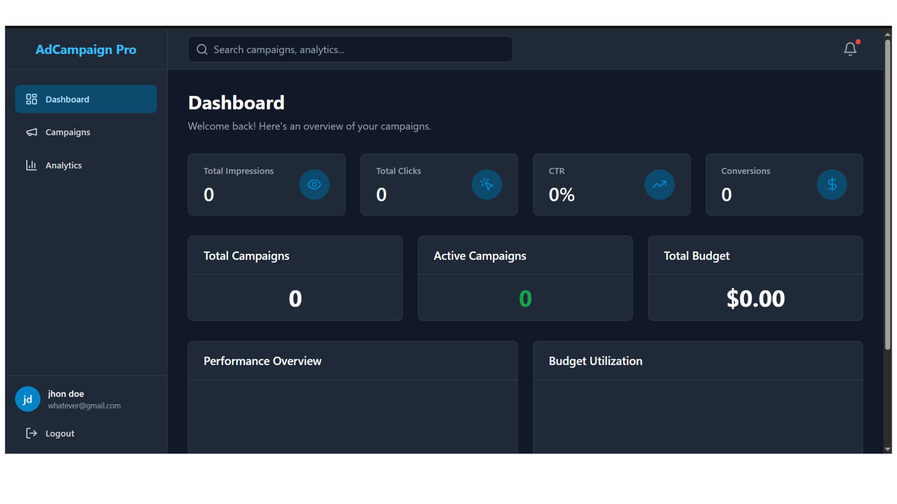
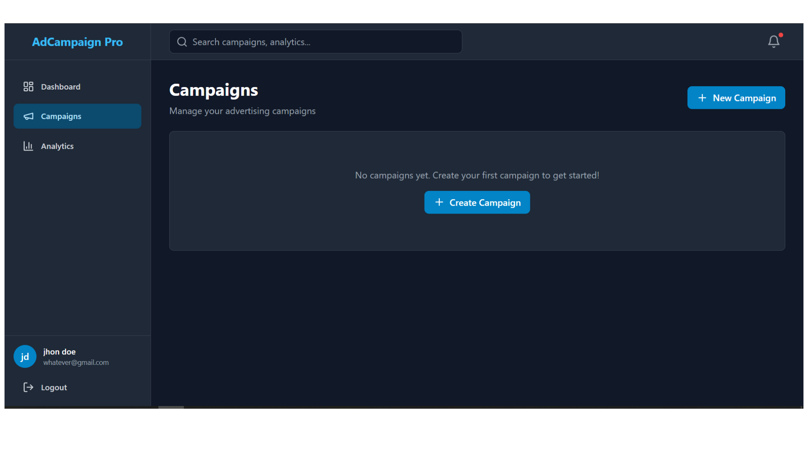

# 🚀 Ad Campaign Management Platform - Backend API

> **A full-stack advertising platform backend showcasing modern Node.js development practices and scalable architecture.**

This is a production-ready REST API built as a portfolio project to demonstrate expertise in backend development, database design, authentication systems, and RESTful API architecture.

[](https://nodejs.org/)
[](https://expressjs.com/)
[](https://www.mongodb.com/)
[](https://jwt.io/)

## ✨ Project Overview

This backend API powers a comprehensive advertising campaign management system with features for user authentication, campaign tracking, analytics, and role-based access control. The project demonstrates clean architecture, security best practices, and production-ready code.




**🎯 Purpose:** Portfolio/Demonstration Project  
**📅 Status:** Active Development  
**🌐 Live API:** [https://ads-platform-backend-9eej.onrender.com](https://ads-platform-backend-9eej.onrender.com)

## 🛠️ Tech Stack

### Core Technologies
- **Runtime:** Node.js (v18+)
- **Framework:** Express.js
- **Database:** MongoDB with Mongoose ODM
- **Authentication:** JWT (JSON Web Tokens) with refresh token mechanism

### Key Libraries & Tools
- **Security:** Helmet.js, bcryptjs, CORS
- **Validation:** Express-validator
- **Logging:** Morgan
- **Environment:** dotenv
- **Deployment:** Docker, Render

## 🎯 Key Features

### 🔐 Authentication & Authorization
- JWT-based authentication with access and refresh tokens
- Role-based access control (Admin/User)
- Secure password hashing with bcrypt
- Token refresh mechanism for seamless user experience

### 📊 Campaign Management
- Complete CRUD operations for advertising campaigns
- Budget tracking and status management
- Campaign statistics and performance metrics
- Creative assets management (images, videos)

### 📈 Analytics Engine
- Real-time analytics event tracking
- Aggregated metrics (impressions, clicks, conversions)
- Campaign-specific analytics
- Performance overview dashboard

### 🔒 Security Features
- Helmet.js for secure HTTP headers
- CORS configuration with origin validation
- Input validation and sanitization
- Environment-based configuration
- Password encryption
- Token expiration and refresh policies

### 🏗️ Architecture Highlights
- RESTful API design
- MVC pattern with clean separation of concerns
- Centralized error handling
- Middleware-based request processing
- Database connection with retry logic
- Graceful shutdown handling

## 📋 Prerequisites

- **Node.js** v18.x or higher
- **MongoDB** v7.x or higher (local or Atlas)
- **npm** v9.x or higher

## � Quick Start

### Installation

1. **Clone the repository**
   ```bash
   git clone <repository-url>
   cd ads-platform-backend
   ```

2. **Install dependencies**
   ```bash
   npm install
   ```

3. **Configure environment variables**
   
   Create a `.env` file in the root directory:
   ```env
   PORT=5000
   NODE_ENV=development
   MONGO_URI=your-mongodb-connection-string
   JWT_SECRET=your-jwt-secret-key
   JWT_REFRESH_SECRET=your-refresh-secret-key
   CLIENT_URL=http://localhost:3000
   ```

4. **Start the server**
   ```bash
   npm start
   ```

   The API will be available at `http://localhost:5000`

### Health Check

Test if the API is running:
```bash
curl http://localhost:5000/health
```

Expected response:
```json
{
  "success": true,
  "message": "Server is running",
  "timestamp": "2026-02-02T10:30:00.000Z"
}
```

## 🐳 Docker Deployment

Build and run with Docker:

```bash
# Build image
docker build -t ads-platform-backend .

# Run container
docker run -d \
  -p 5000:5000 \
  -e MONGO_URI=your-mongodb-uri \
  -e JWT_SECRET=your-secret \
  -e JWT_REFRESH_SECRET=your-refresh-secret \
  --name ads-backend \
  ads-platform-backend
```

## 📚 API Endpoints

### Public Endpoints
- `GET /health` - Server health check

### Authentication
- `POST /api/auth/register` - Register new user
- `POST /api/auth/login` - Login user
- `POST /api/auth/refresh` - Refresh access token
- `POST /api/auth/logout` - Logout user (requires auth)
- `GET /api/auth/profile` - Get user profile (requires auth)

### User Management (Protected)
- `GET /api/users` - Get all users (Admin only)
- `GET /api/users/:id` - Get user by ID
- `PUT /api/users/:id` - Update user
- `DELETE /api/users/:id` - Delete user (Admin only)

### Campaign Management (Protected)
- `GET /api/campaigns` - Get all campaigns
- `POST /api/campaigns` - Create new campaign
- `GET /api/campaigns/:id` - Get campaign by ID
- `PUT /api/campaigns/:id` - Update campaign
- `DELETE /api/campaigns/:id` - Delete campaign
- `GET /api/campaigns/:id/stats` - Get campaign statistics

### Analytics (Protected)
- `GET /api/analytics/overview` - Get analytics overview
- `GET /api/analytics/campaigns/:id` - Get campaign-specific analytics
- `POST /api/analytics/events` - Track analytics event

> 📖 For detailed API documentation with request/response examples, see [API.md](./API.md)

## 🏗️ Project Structure

```
ads-platform-backend/
├── src/
│   ├── config/              # Configuration files
│   │   ├── env.js          # Environment variable management
│   │   └── database.js     # MongoDB connection setup
│   ├── controllers/         # Business logic & request handlers
│   │   ├── authController.js
│   │   ├── userController.js
│   │   ├── campaignController.js
│   │   └── analyticsController.js
│   ├── middleware/          # Custom middleware
│   │   ├── auth.js         # JWT authentication
│   │   ├── validator.js    # Request validation
│   │   └── errorHandler.js # Error handling
│   ├── models/              # Mongoose schemas & models
│   │   ├── User.js
│   │   ├── Campaign.js
│   │   ├── Creative.js
│   │   └── AnalyticsEvent.js
│   ├── routes/              # API route definitions
│   │   ├── auth.js
│   │   ├── users.js
│   │   ├── campaigns.js
│   │   └── analytics.js
│   ├── utils/               # Helper functions
│   │   └── tokenUtils.js
│   └── server.js            # Application entry point
├── .env.example             # Environment variables template
├── .gitignore
├── Dockerfile               # Docker configuration
├── package.json
├── API.md                   # API documentation
└── README.md
```

## 🌍 Environment Variables

| Variable | Description | Required | Default |
|----------|-------------|----------|---------|
| `PORT` | Server port | No | `5000` |
| `NODE_ENV` | Environment mode | No | `development` |
| `MONGO_URI` | MongoDB connection string | **Yes** | - |
| `JWT_SECRET` | JWT signing secret | **Yes** | - |
| `JWT_REFRESH_SECRET` | Refresh token secret | **Yes** | - |
| `JWT_EXPIRES_IN` | Access token expiration | No | `1h` |
| `JWT_REFRESH_EXPIRES_IN` | Refresh token expiration | No | `7d` |
| `CLIENT_URL` | Frontend URL (CORS) | No | `http://localhost:3000` |

> ⚠️ **Important:** Always use strong, unique secrets in production environments.

## � Docker Deployment

Build and run with Docker:

```bash
# Build image
docker build -t ads-platform-backend .

# Run container
docker run -d \
  -p 5000:5000 \
  -e MONGO_URI=your-mongodb-uri \
  -e JWT_SECRET=your-secret \
  -e JWT_REFRESH_SECRET=your-refresh-secret \
  --name ads-backend \
  ads-platform-backend
```

## 🚀 Deployment

This application is configured for easy deployment on:
- **Render** (currently live)
- **Heroku**
- **Railway**
- **AWS EC2**
- **DigitalOcean**
- **Vercel** (Serverless)

### Deployment Checklist
- ✅ Set all required environment variables
- ✅ Configure MongoDB Atlas or managed database
- ✅ Update `CLIENT_URL` to your frontend domain
- ✅ Ensure `NODE_ENV=production`
- ✅ Set strong JWT secrets

## 💡 Key Implementation Highlights

### Authentication Flow
- User registration with email validation
- Password hashing using bcrypt (10 salt rounds)
- JWT access token (1h expiry) for API requests
- Refresh token (7d expiry) stored in database
- Token refresh endpoint for seamless UX
- Protected routes with middleware authentication

### Database Design
- **Users Collection:** Email, password hash, role, profile info
- **Campaigns Collection:** Title, budget, status, dates, owner reference
- **Creatives Collection:** File references, campaign links
- **Analytics Events Collection:** Event tracking with timestamps

### Error Handling
- Centralized error handler middleware
- Consistent error response format
- Environment-aware error details
- HTTP status codes following REST conventions
- Validation error messages

### Security Measures
- Input validation on all endpoints
- SQL injection prevention via Mongoose
- XSS protection via Helmet
- CORS with origin whitelist
- Rate limiting ready (extensible)
- No sensitive data in logs

## 🧪 Testing Examples

### Register User
```bash
curl -X POST http://localhost:5000/api/auth/register \
  -H "Content-Type: application/json" \
  -d '{
    "email": "user@example.com",
    "password": "securepass123",
    "firstName": "John",
    "lastName": "Doe"
  }'
```

### Login
```bash
curl -X POST http://localhost:5000/api/auth/login \
  -H "Content-Type: application/json" \
  -d '{
    "email": "user@example.com",
    "password": "securepass123"
  }'
```

### Access Protected Endpoint
```bash
curl http://localhost:5000/api/auth/profile \
  -H "Authorization: Bearer YOUR_ACCESS_TOKEN"
```

## 🎓 Learning Objectives Demonstrated

This project showcases proficiency in:
- ✅ RESTful API design and implementation
- ✅ Authentication and authorization patterns
- ✅ Database modeling and relationships
- ✅ Security best practices
- ✅ Error handling and validation
- ✅ Clean code architecture (MVC pattern)
- ✅ Environment-based configuration
- ✅ Middleware design patterns
- ✅ Token-based authentication
- ✅ Production deployment practices

## 📄 License

This project is licensed under the MIT License - see the [LICENSE](LICENSE) file for details.

## 👨‍💻 About

This project was built to demonstrate modern backend development practices and showcase skills in:
- Node.js/Express backend development
- MongoDB database design
- RESTful API architecture
- Authentication systems
- Security implementation
- Production deployment

**Note:** This is a portfolio project created for demonstration and learning purposes.

---

**Built with** ❤️ **using Node.js, Express, and MongoDB**

For questions or collaboration opportunities, feel free to reach out!
